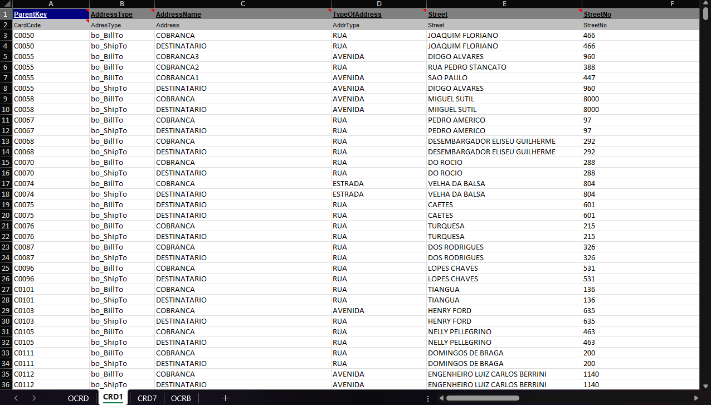
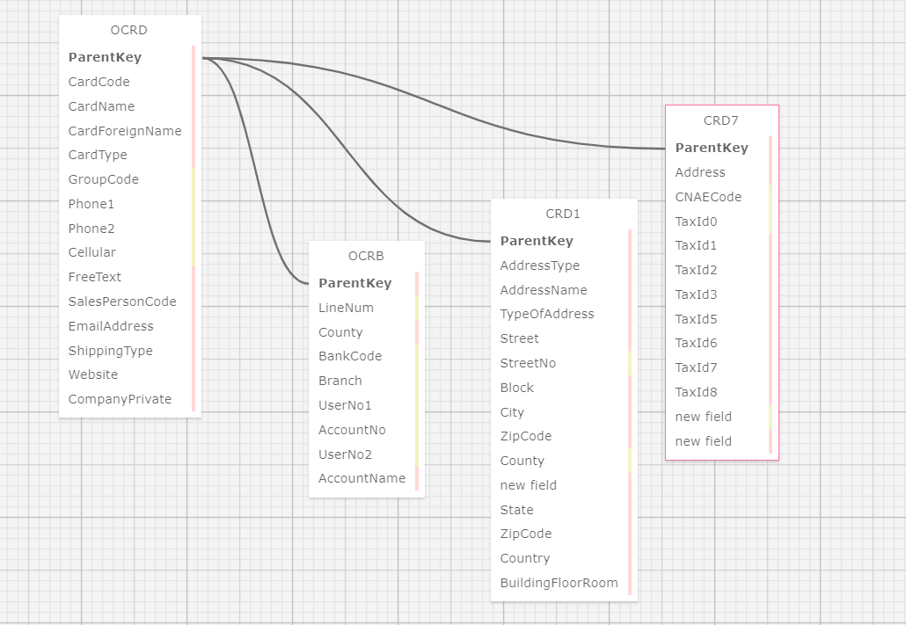

# Ponderada_Afonso-S7

Para a construção deste modelo relacional foi levada em consideração a planilha de dados mestres, a qual pode ser visualizada na Figura 1. No que diz respeito às chaves do modelo, visto na Figura 2, adotei a coluna "PartentKey" como sendo uma chave estrangeira. Isto, pois ela se repete em 3 tabelas, nas quais ela notoriamente não é uma chave primária devido às suas repetições ao decorrer das linhas. Por este motivo, adotei esta como a coluna de chaves primárias da tabela OCRD, onde ela não é aparente. Meu raciocínio pode estar muito errado, mas foi o que entendi. 

<div align="center">
<sub>Figura 1 - Dados da G2 Tecnologia</sub>

<sup>Fonte: Material enviado pela G2 (2024)</sup>
</div>


<div align="center">
<sub>Figura 2 - Persona Carol Bispo</sub>

<sup>Fonte: Material produzido pelo autor (2024)</sup>
</div>


Segue abaixo o XML do meu modelo relacional criado no SQL Designer:


```xml 
<?xml version="1.0" encoding="utf-8" ?>
<!-- SQL XML created by WWW SQL Designer, https://github.com/ondras/wwwsqldesigner/ -->
<!-- Active URL: https://sql.toad.cz/ -->
<sql>
<datatypes db="mysql">
	<group label="Numeric" color="rgb(238,238,170)">
		<type label="Integer" length="0" sql="INTEGER" quote=""/>
	 	<type label="TINYINT" length="0" sql="TINYINT" quote=""/>
	 	<type label="SMALLINT" length="0" sql="SMALLINT" quote=""/>
	 	<type label="MEDIUMINT" length="0" sql="MEDIUMINT" quote=""/>
	 	<type label="INT" length="0" sql="INT" quote=""/>
		<type label="BIGINT" length="0" sql="BIGINT" quote=""/>
		<type label="Decimal" length="1" sql="DECIMAL" re="DEC" quote=""/>
		<type label="Single precision" length="0" sql="FLOAT" quote=""/>
		<type label="Double precision" length="0" sql="DOUBLE" re="DOUBLE" quote=""/>
	</group>

	<group label="Character" color="rgb(255,200,200)">
		<type label="Char" length="1" sql="CHAR" quote="'"/>
		<type label="Varchar" length="1" sql="VARCHAR" quote="'"/>
		<type label="Text" length="0" sql="MEDIUMTEXT" re="TEXT" quote="'"/>
		<type label="Binary" length="1" sql="BINARY" quote="'"/>
		<type label="Varbinary" length="1" sql="VARBINARY" quote="'"/>
		<type label="BLOB" length="0" sql="BLOB" re="BLOB" quote="'"/>
	</group>

	<group label="Date &amp; Time" color="rgb(200,255,200)">
		<type label="Date" length="0" sql="DATE" quote="'"/>
		<type label="Time" length="0" sql="TIME" quote="'"/>
		<type label="Datetime" length="0" sql="DATETIME" quote="'"/>
		<type label="Year" length="0" sql="YEAR" quote=""/>
		<type label="Timestamp" length="0" sql="TIMESTAMP" quote="'"/>
	</group>
	
	<group label="Miscellaneous" color="rgb(200,200,255)">
		<type label="ENUM" length="1" sql="ENUM" quote=""/>
		<type label="SET" length="1" sql="SET" quote=""/>
		<type label="Bit" length="0" sql="bit" quote=""/>
	</group>
</datatypes><table x="79" y="24" name="OCRD">
<row name="ParentKey" null="1" autoincrement="1">
<datatype>VARCHAR(5)</datatype>
<default>NULL</default><relation table="OCRB" row="ParentKey" />
<relation table="CRD1" row="ParentKey" />
<relation table="CRD7" row="ParentKey" />
</row>
<row name="CardCode" null="1" autoincrement="0">
<datatype>VARCHAR(5)</datatype>
<default>NULL</default></row>
<row name="CardName" null="1" autoincrement="0">
<datatype>VARCHAR(100)</datatype>
<default>NULL</default></row>
<row name="CardForeignName" null="1" autoincrement="0">
<datatype>VARCHAR(50)</datatype>
<default>NULL</default></row>
<row name="CardType" null="1" autoincrement="0">
<datatype>VARCHAR(10)</datatype>
<default>NULL</default></row>
<row name="GroupCode" null="1" autoincrement="0">
<datatype>INT</datatype>
<default>NULL</default></row>
<row name="Phone1" null="1" autoincrement="0">
<datatype>INTEGER</datatype>
<default>NULL</default></row>
<row name="Phone2" null="1" autoincrement="0">
<datatype>INTEGER</datatype>
<default>NULL</default></row>
<row name="Cellular" null="1" autoincrement="0">
<datatype>INTEGER</datatype>
<default>NULL</default></row>
<row name="FreeText" null="1" autoincrement="0">
<datatype>MEDIUMTEXT</datatype>
<default>NULL</default></row>
<row name="SalesPersonCode" null="1" autoincrement="0">
<datatype>VARCHAR(50)</datatype>
<default>NULL</default></row>
<row name="EmailAddress" null="1" autoincrement="0">
<datatype>VARCHAR(20)</datatype>
<default>NULL</default></row>
<row name="ShippingType" null="1" autoincrement="0">
<datatype>VARCHAR</datatype>
<default>NULL</default></row>
<row name="Website" null="1" autoincrement="0">
<datatype>VARCHAR</datatype>
<default>NULL</default></row>
<row name="CompanyPrivate" null="1" autoincrement="0">
<datatype>VARCHAR(8)</datatype>
<default>NULL</default></row>
<key type="PRIMARY" name="">
<part>ParentKey</part>
</key>
</table>
<table x="316" y="238" name="OCRB">
<row name="ParentKey" null="1" autoincrement="1">
<datatype>VARCHAR(5)</datatype>
<default>NULL</default></row>
<row name="LineNum" null="1" autoincrement="0">
<datatype>INTEGER(1)</datatype>
<default>NULL</default></row>
<row name="County" null="1" autoincrement="0">
<datatype>VARCHAR(2)</datatype>
<default>NULL</default></row>
<row name="BankCode" null="1" autoincrement="0">
<datatype>INTEGER(3)</datatype>
<default>NULL</default></row>
<row name="Branch" null="1" autoincrement="0">
<datatype>INTEGER(4)</datatype>
<default>NULL</default></row>
<row name="UserNo1" null="1" autoincrement="0">
<datatype>INTEGER</datatype>
<default>NULL</default></row>
<row name="AccountNo" null="1" autoincrement="0">
<datatype>INTEGER(10)</datatype>
<default>NULL</default></row>
<row name="UserNo2" null="1" autoincrement="0">
<datatype>INTEGER</datatype>
<default>NULL</default></row>
<row name="AccountName" null="1" autoincrement="0">
<datatype>VARCHAR(40)</datatype>
<default>NULL</default></row>
<key type="PRIMARY" name="">
<part>ParentKey</part>
</key>
</table>
<table x="488" y="198" name="CRD1">
<row name="ParentKey" null="1" autoincrement="1">
<datatype>VARCHAR(5)</datatype>
<default>NULL</default></row>
<row name="AddressType" null="1" autoincrement="0">
<datatype>VARCHAR(10)</datatype>
<default>NULL</default></row>
<row name="AddressName" null="1" autoincrement="0">
<datatype>VARCHAR(15)</datatype>
<default>NULL</default></row>
<row name="TypeOfAddress" null="1" autoincrement="0">
<datatype>VARCHAR(15)</datatype>
<default>NULL</default></row>
<row name="Street" null="1" autoincrement="0">
<datatype>VARCHAR(30)</datatype>
<default>NULL</default></row>
<row name="StreetNo" null="1" autoincrement="0">
<datatype>INTEGER(10)</datatype>
<default>NULL</default></row>
<row name="Block" null="1" autoincrement="0">
<datatype>VARCHAR(20)</datatype>
<default>NULL</default></row>
<row name="City" null="1" autoincrement="0">
<datatype>VARCHAR(20)</datatype>
<default>NULL</default></row>
<row name="ZipCode" null="1" autoincrement="0">
<datatype>VARCHAR(9)</datatype>
<default>NULL</default></row>
<row name="County" null="1" autoincrement="0">
<datatype>INTEGER(4)</datatype>
<default>NULL</default></row>
<row name="new field" null="1" autoincrement="0">
<datatype>VARCHAR(2)</datatype>
<default>NULL</default></row>
<row name="State" null="1" autoincrement="0">
<datatype>VARCHAR(2)</datatype>
<default>NULL</default></row>
<row name="ZipCode" null="1" autoincrement="0">
<datatype>VARCHAR(9)</datatype>
<default>NULL</default></row>
<row name="Country" null="1" autoincrement="0">
<datatype>VARCHAR(2)</datatype>
<default>NULL</default></row>
<row name="BuildingFloorRoom" null="1" autoincrement="0">
<datatype>VARCHAR(15)</datatype>
<default>NULL</default></row>
<key type="PRIMARY" name="">
<part>ParentKey</part>
</key>
</table>
<table x="654" y="110" name="CRD7">
<row name="ParentKey" null="1" autoincrement="1">
<datatype>VARCHAR(5)</datatype>
<default>NULL</default></row>
<row name="Address" null="1" autoincrement="0">
<datatype>VARCHAR(10)</datatype>
<default>NULL</default></row>
<row name="CNAECode" null="1" autoincrement="0">
<datatype>INTEGER</datatype>
<default>NULL</default></row>
<row name="TaxId0" null="1" autoincrement="0">
<datatype>INTEGER(18)</datatype>
<default>NULL</default></row>
<row name="TaxId1" null="1" autoincrement="0">
<datatype>VARCHAR</datatype>
<default>NULL</default></row>
<row name="TaxId2" null="1" autoincrement="0">
<datatype>VARCHAR</datatype>
<default>NULL</default></row>
<row name="TaxId3" null="1" autoincrement="0">
<datatype>VARCHAR(11)</datatype>
<default>NULL</default></row>
<row name="TaxId5" null="1" autoincrement="0">
<datatype>VARCHAR</datatype>
<default>NULL</default></row>
<row name="TaxId6" null="1" autoincrement="0">
<datatype>VARCHAR</datatype>
<default>NULL</default></row>
<row name="TaxId7" null="1" autoincrement="0">
<datatype>VARCHAR</datatype>
<default>NULL</default></row>
<row name="TaxId8" null="1" autoincrement="0">
<datatype>VARCHAR</datatype>
<default>NULL</default></row>
<row name="new field" null="1" autoincrement="0">
<datatype>INTEGER</datatype>
<default>NULL</default></row>
<row name="new field" null="1" autoincrement="0">
<datatype>VARCHAR</datatype>
<default>NULL</default></row>
<key type="PRIMARY" name="">
<part>ParentKey</part>
</key>
</table>
</sql>

```